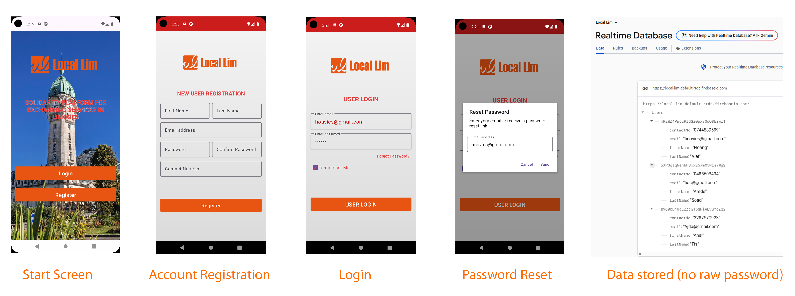
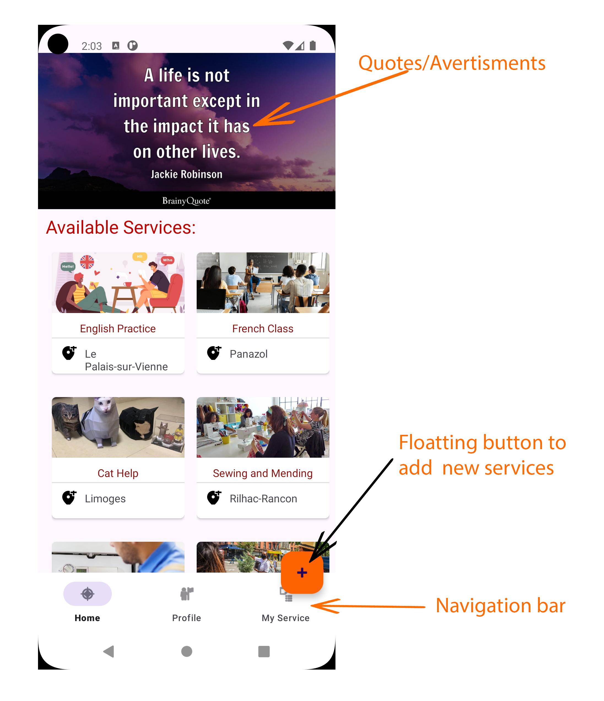
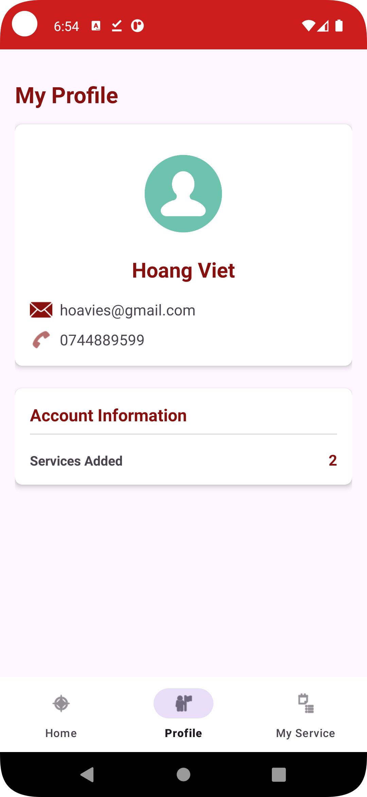
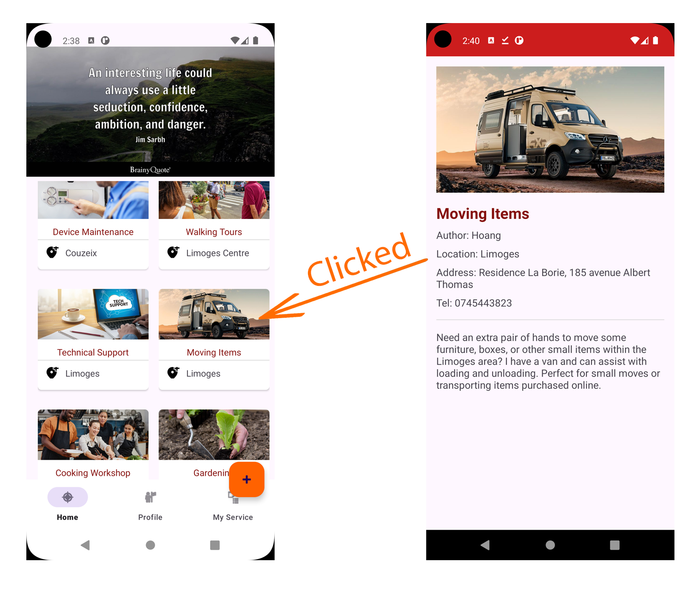
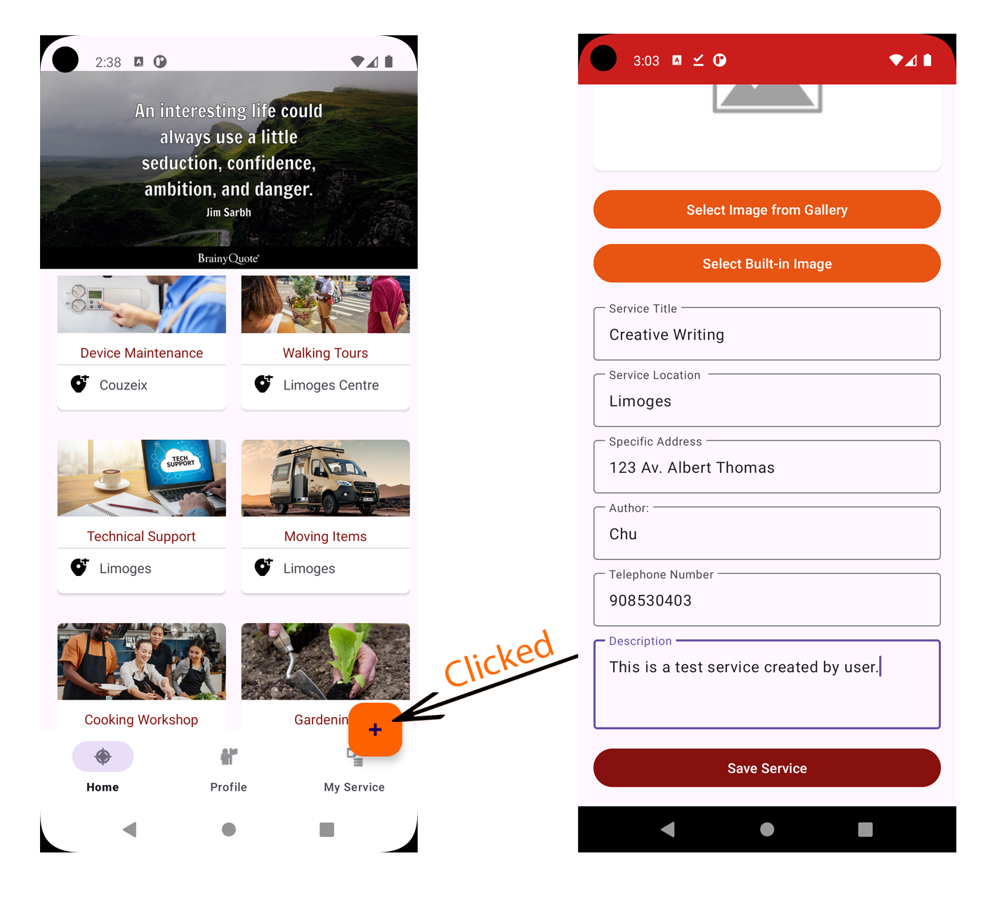
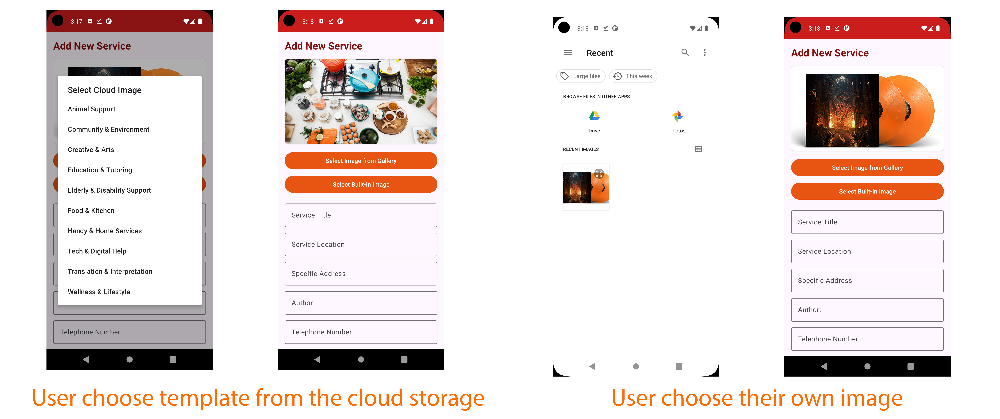
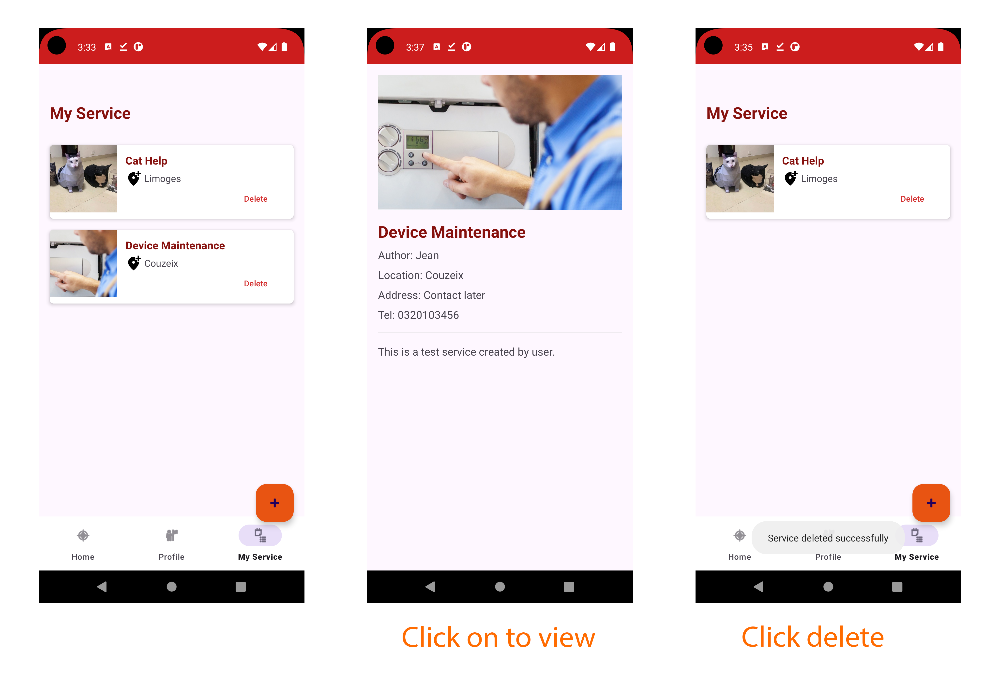

#### LocalLim: Community Services Platform

Mobile Application Development - University Project:

Author: Hoang Viet

#### 1. Features and Implementation 1.1. Authentication System

We implemented a comprehensive user authentication system using Firebase Authentication with the following capabilities:

- User registration and login using email/password using Filebase realtime database
- "Remember Me" checkbox that saves login credentials using SharedPreferences
- Password recovery feature that sends reset emails to users
- Secure storage of user credentials where even administrators cannot access plain passwords

During registration (implemented in RegisterActivity.java), users provide their first name, last name, email, password, and contact number. This information is securely stored in Firebase Realtime Database. Instead of storing raw passwords in the database, Firebase Authentication uses industry-standard hashing algorithms to encrypt password data. This means that even if someone gains access to the database (including administrators), they cannot see or retrieve the actual passwords.

## 1.2. Banner System and Navigation

We implemented a dynamic banner system on the home screen using Android's ViewFlipper component. The banner:

- Automatically rotates through images (currently it is just display the quote but can be used for advertising)
- Uses fade-in/fade-out animations for smooth transitions
- Displays service-related promotional content

For navigation, we implemented a bottom navigation bar that provides easy access to:

- Home screen (service listings)
- User profile
- My Services section

Additionally, a floating action button provides quick access to the service creation form from the main screen.

### 1.3. User Profile Management

The app provides a dedicated profile section (ProfileActivity.java) where users can view:

- Their full name
- Email address
- Contact number
- Number of services they have added to the platform

The profile information is retrieved in real-time from Firebase Realtime Database, ensuring that any updates to user information are immediately reflected. We also implemented a service counter that queries Cloud Firestore to calculate how many services the current user has created, displaying this statistic on their profile page.

## 1.4. Service Management

The core functionality of the application revolves around service listings:

- Service Browsing: The main screen (BannerActivity.java) displays all available services in a visually appealing grid layout using RecyclerView.
- Service Details: Users can tap on any service to view complete information in ServiceDetailsActivity.java.

- Service Creation: Users can add new services through a comprehensive form in AddServiceActivity.java, providing details such as title, location, specific address, author name, telephone number, and description.

- Manage Services: The "My Services" section allows users to view and manage the services they've created, with the ability to delete their own listings.
- 1.5. Service Creation and Image Management System

We implemented a comprehensive service creation system in AddServiceActivity.java that allows users to easily add their own services to the platform. The service creation form includes fields for:

## 1.6. Image Selection System

One of the technical challenges we faced was implementing a flexible image selection system. We have developed a solution that provides users with two options when creating service listings:

- 1. Device Gallery: Users can select images from their device by tapping "Select Image from Gallery", which uses Android's content providers to access local images

- 2. Cloud Images: By tapping "Select Built-in Image", users can choose from shared images stored in Firebase Storage that are accessible to all users

## 1.7. Service Management and Deletion

User can view their uploaded services by clicking on the "My services" tab in the navigation bar.

Here, they can view all the services they have published. Each service can also be clicked to see all the details. They can delete service that is no longer available using the delete button.

## 2. Testing environment

Login credentials: hoavies@gmail.com Password: 123456 test@gmail.com Password: testpass

Emulators: Small Phone: API Level: 28 Android 9.0 Pie x86 Resolution: 720x1280px Ram: 2GB, Storage 16GB

Honor Magic 4 Pro: API Level: 31 Android 15 x86\_64 Resolution: 1312x2848px Ram 8GB, Storage 256G